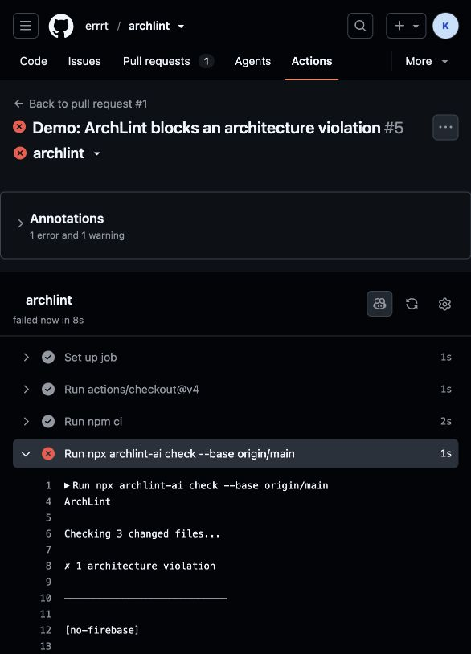

# ArchLint

**ESLint for AI coding agents. Stop Claude, Codex, Cursor, and human contributors from breaking your architecture.**

[](https://www.npmjs.com/package/archlint-ai)
[](https://github.com/errrt/archlint/actions/workflows/ci.yml)

ArchLint checks Git diffs against architecture rules committed with your project. It is agent-independent, deterministic by default, and designed for local use and CI.

CLAUDE.md and AGENTS.md are instructions. ArchLint turns your most important architecture decisions into checks that can block a pull request.

```text
AI or developer changes code
              ↓
           Git diff
              ↓
           ArchLint
              ↓
       PASS or BLOCKED
```



## Quick start

From the root of any Git repository:

```bash
npx archlint-ai init
npx archlint-ai check
```

The first command creates `.archlint.yml`. The second checks staged, unstaged, and untracked changes. No global installation, account, API key, or dashboard is required.

```text
✓ 3 rules passed

NO ARCHITECTURE DRIFT DETECTED
```

When a rule is broken:

```text
[no-firebase]

src/auth/firebase.ts:1

Use Supabase Auth only.

Evidence: firebase
Severity: ERROR
```

## Rules

```yaml
version: 1
rules:
  - id: no-firebase
    type: forbidden_dependency
    packages: [firebase]
    message: "Use Supabase Auth only."

  - id: db-boundary
    type: import_boundary
    from: ["src/components/**"]
    deny: ["src/db/**"]
    message: "UI components must not access the database directly."

  - id: protect-auth
    type: protected_path
    paths: ["src/auth/**"]
    severity: warning
```

`forbidden_dependency` checks newly added JS/TS imports, `require` calls, dynamic imports, and `package.json` dependencies. `import_boundary` checks newly added JS/TS imports and supports relative paths and project-root-style paths. `protected_path` reports any changed matching path.

Only additions in the Git diff are inspected for dependency and import violations, minimizing false positives from existing code.

## Pull requests

```bash
npx archlint-ai check --base origin/main
```

Copy [`examples/github-action.yml`](examples/github-action.yml) into `.github/workflows/archlint.yml`. Ensure checkout uses `fetch-depth: 0`.

## Exit codes

- `0`: pass (warnings may be present)
- `1`: at least one error-severity architecture violation
- `2`: configuration, Git, or runtime error

## Privacy and semantic rules

All deterministic rules run 100% locally. No repository code is uploaded by them. Semantic rules are experimental: v0.1 defines a provider-neutral `SemanticEvaluator` interface but does not send code to an LLM or include a provider. A configured semantic rule therefore performs no remote work.

## Templates

Starter configurations are available in `templates/` for Next.js + Supabase, Next.js + Prisma, clean architecture, and minimal AI safety.

## Use in GitHub Actions

Add `.github/workflows/archlint.yml`:

```yaml
name: ArchLint
on:
  pull_request:

jobs:
  archlint:
    runs-on: ubuntu-latest
    steps:
      - uses: actions/checkout@v4
        with:
          fetch-depth: 0
      - run: npx archlint-ai check --base origin/${{ github.event.repository.default_branch }}
```

Every pull request is then checked automatically. Fix the code when a rule is violated, or review and change `.archlint.yml` when the architecture decision itself has intentionally changed.

## Contributing and rule requests

ArchLint v0.1 is deliberately small. If an architecture constraint cannot be expressed with the current rules, [open an issue](https://github.com/errrt/archlint/issues) and describe the code pattern you want to prevent. Concrete rule requests guide the roadmap.
